# Exercice d'évaluation pour le poste Inria / AP-HP

## Prérequis

Une installation fonctionnelle du gestionnaire d'environnement `conda`.

Je recommande la distribution [miniconda](https://docs.conda.io/en/latest/miniconda.html).

## Démarrage

Provisionnez l'environnment avec `conda`.

```sh
conda env create
```

Activez l'environnement dans votre shell.

```sh
conda activate inria-aphp-assignment
```

---

:warning: Pour fonctionner, `conda activate` peut nécessiter une étape d'initialisation avec `conda init`.

---

Lancez Jupyter et accedez à l'interface web.

```sh
jupyter notebook
```

Ouvrir l'un des fichiers `.ipynb` ci-dessous.

## Contenu

Ce répertoire contient les fichiers notebook suivants :

- `qa.ipynb` : le notebook contenant l'analyse de qualité du dataset
- `eda.ipynb` : le notebook contenant l'analyse exploratoire du dataset

Ces fichiers utilisent les ressources suivantes :

- `data.db` : la base de données contenant le jeu de données brut
- `entity_resolution.py` : un module utilitaire contenant le code de nettoyage et déduplication du dataset
- `getting_started.py` : un module utilitaire contenant le code partagé de chargement du dataset
- `state_postcode.csv` : le référentiel des [états et codes postaux australiens](https://en.wikipedia.org/wiki/Postcodes_in_Australia)
- `aus_state.geojson` : une [carte de l'Australie](https://exploratory.io/map) au format GeoJSON distribuée sous licence MIT
- `australian_postcodes.csv` : un référentiel des [codes postaux avec leurs coordonnées géodésiques](https://www.matthewproctor.com/australian_postcodes)

## Traitement des données

Le graphique ci-dessous illuste les traitements séquentiels effectués sur les données par la fonction `detect_duplicates` utilisée dans l'analyse exploratoire.

